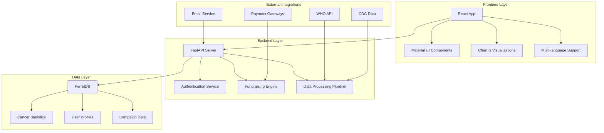

# Fighting Cancer Now
An open-source global initiative aimed at centralizing cancer-related data and providing a platform for collective fundraising in the oncology field.

<div align="center">
  
  
  <h3> Global Cancer Data Hub & Fundraising Platform</h3>
  
  <p>
    <strong>An open-source initiative to centralize cancer data worldwide and empower collective action through transparent fundraising</strong>
  </p>

  
  [](https://opensource.org/licenses/MIT)
  [](http://makeapullrequest.com)
  [](https://github.com/your-username/fighting-cancer-now/stargazers)
</div>

---

##  Vision

To create a unified, transparent, and global system that connects individuals, organizations, researchers, and healthcare institutions in the fight against cancer. By combining open data accessibility with collective fundraising action, we aim to accelerate progress in cancer treatment, support, and research worldwide.

##  Key Features

###  Global Cancer Data Hub
- **Real-world Statistics**: Centralization of cancer data from trusted sources (WHO, CDC, INCA, IARC)
- **Interactive Visualizations**: Dynamic charts, maps, and trend analysis
- **Open Data API**: RESTful API for researchers and developers
- **Data Validation**: Automated quality checks and source verification

### Transparent Fundraising Platform
- **Individual Campaigns**: Support for patients and families
- **Hospital Projects**: Funding for medical equipment and infrastructure
- **Research Initiatives**: Support for scientific studies and clinical trials
- **Transparency Reports**: Real-time tracking of fund allocation and impact

###  Community & Collaboration
- **Multi-language Support**: Available in English, Portuguese, Spanish, and French
- **Open Source**: Community-driven development and contributions
- **Global Reach**: Designed for international use and collaboration
- **Impact Tracking**: Measure and report the real-world impact of donations

##  Architecture Overview



## 🚀 Quick Start

### Prerequisites

- **Node.js** 18+ and npm
- **Python** 3.11+
- **Docker** and Docker Compose
- **Git**

### Installation

1. **Clone the repository**
   ```bash
   git clone https://github.com/fighting-cancer-now/Fighting-Cancer-Now-web.git
   cd fighting-cancer-now
   ```

2. **Run the setup script**
   ```bash
   chmod +x tools/scripts/setup.sh
   ./tools/scripts/setup.sh
   ```

3. **Configure environment**
   ```bash
   cp .env.example .env
   # Edit .env with your configuration
   ```

4. **Start development environment**
   ```bash
   npm run dev
   ```

5. **Access the application**
   - Frontend: http://localhost:3000
   - Backend API: http://localhost:8000
   - API Documentation: http://localhost:8000/docs

## 📁 Project Structure

```
Fighting-Cancer-Now/
├── 📁 .github/                 # GitHub workflows, templates
├── 📁 assets/                  # Static assets (images, documents)
├── 📁 config/                  # Global configuration files
├── 📁 database/                # Database schemas and seeds
├── 📁 docs/                    # Documentation and guides
├── 📁 infrastructure/          # Docker, K8s, monitoring setup
├── 📁 src/                     # Source code
│   ├── 📁 frontend/           # React application
│   ├── 📁 backend/            # FastAPI server
│   └── 📁 shared/             # Shared code and types
├── 📁 tests/                   # Automated tests
├── 📁 tools/                   # Development tools and scripts
├── 🔧 docker-compose.yml      # Development environment
├── 🔧 package.json            # Global scripts and dependencies
└── 📄 README.md               # This file
```

<details>
<summary>🔍 <strong>Detailed Structure</strong></summary>

### Frontend (`src/frontend/`)
```
src/frontend/
├── public/                    # Static files
├── src/
│   ├── components/           # Reusable UI components
│   │   ├── common/          # Base components (Button, Modal)
│   │   ├── forms/           # Form components
│   │   ├── charts/          # Data visualization
│   │   └── layout/          # Header, Footer, Navigation
│   ├── pages/               # Application pages
│   │   ├── Home/            # Landing page
│   │   ├── Dashboard/       # User dashboard
│   │   ├── Fundraising/     # Campaign management
│   │   ├── DataHub/         # Cancer data exploration
│   │   └── Profile/         # User profile
│   ├── services/            # API integration
│   ├── hooks/               # Custom React hooks
│   ├── context/             # State management
│   ├── locales/             # i18n translations
│   └── styles/              # Styling and themes
```

### Backend (`src/backend/`)
```
src/backend/
├── app/
│   ├── api/v1/              # REST API endpoints
│   ├── core/                # Business logic
│   │   ├── auth/           # Authentication & authorization
│   │   ├── fundraising/    # Campaign and donation logic
│   │   ├── data/           # Data processing and ETL
│   │   └── notifications/  # Email and push notifications
│   ├── models/             # Database models
│   ├── schemas/            # API request/response schemas
│   └── utils/              # Utility functions
├── migrations/             # Database migrations
└── scripts/                # Utility scripts
```
</details>

##  Development

### Available Scripts

```bash
# Development
npm run dev             # Start development environment
npm run build           # Build for production
npm run test            # Run all tests
npm run lint            # Run linting

# Frontend specific
npm run test:frontend   # Run frontend tests
npm run lint:frontend   # Lint frontend code

# Backend specific  
npm run test:backend    # Run backend tests
npm run lint:backend    # Lint backend code

# Database
npm run db:migrate      # Run database migrations
npm run db:seed         # Seed database with sample data
```

### Testing

We maintain high code quality with comprehensive testing:

- **Unit Tests**: Individual component and function testing
- **Integration Tests**: API endpoint and service integration
- **End-to-End Tests**: Complete user workflow testing
- **Coverage**: Minimum 80% code coverage maintained

```bash
# Run specific test suites
npm run test:unit
npm run test:integration  
npm run test:e2e

# Generate coverage reports
npm run test:coverage
```

### Code Quality

```bash
# Formatting
npm run format          # Format code with Prettier
npm run format:check    # Check formatting

# Linting
npm run lint:fix        # Auto-fix linting issues
npm run lint:check      # Check for linting issues

# Type checking
npm run type:check      # TypeScript type checking
```

##  Internationalization

Fighting Cancer Now supports multiple languages to serve our global community:

- 🇺🇸 **English** (en) - Primary language
- 🇧🇷 **Portuguese** (pt-BR) - Brazilian Portuguese
- 🇪🇸 **Spanish** (es) - Spanish
- 🇫🇷 **French** (fr) - French

### Adding New Languages

1. Create translation file: `src/frontend/src/locales/[lang].json`
2. Add language support in `src/frontend/src/i18n/index.js`
3. Update language selector component
4. Test the new language integration

##  Security

Security is paramount in handling sensitive health data and financial transactions:

### Data Protection
- **Encryption**: All data encrypted at rest and in transit
- **Authentication**: JWT-based authentication with refresh tokens
- **Authorization**: Role-based access control (RBAC)
- **Validation**: Comprehensive input validation and sanitization

### Compliance
- **GDPR**: Full compliance with European data protection regulation
- **HIPAA**: Health data handling follows HIPAA guidelines where applicable
- **PCI DSS**: Payment processing meets security standards

### Security Practices
```bash
# Security scanning
npm run security:scan    # Scan dependencies for vulnerabilities
npm run security:audit   # Security audit of the codebase
```

##  Data Sources

We integrate with trusted global health organizations:

| Organization | Data Type | Update Frequency |
|-------------|-----------|------------------|
| **WHO** (World Health Organization) | Global cancer statistics | Monthly |
| **CDC** (Centers for Disease Control) | US cancer data | Quarterly |
| **INCA** (Instituto Nacional de Câncer) | Brazilian cancer data | Bi-annually |
| **IARC** (International Agency for Research on Cancer) | Research data | Annually |
| **GLOBOCAN** | Global cancer incidence | Annually |

### API Integration

```javascript
// Example: Fetching WHO cancer data
const cancerData = await api.get('/data/who/cancer-statistics', {
  params: {
    country: 'BR',
    cancerType: 'breast',
    year: 2023
  }
});
```

##  Payment Integration

Secure and transparent donation processing:

### Supported Payment Methods
- **Credit/Debit Cards** (Visa, Mastercard, American Express)
- **PayPal** integration
- **Bank Transfers** (country-specific)
- **Cryptocurrency** (Bitcoin, Ethereum) - *Coming soon*

### Payment Processors
- **Stripe** - Primary payment processor
- **PayPal** - Alternative payment method
- **Local Gateways** - Region-specific processors

### Donation Transparency
- Real-time tracking of donations
- Detailed impact reports
- Automated tax receipt generation
- Public transparency dashboard

##  Deployment

### Production Deployment

1. **Environment Setup**
   ```bash
   cp .env.example .env.production
   # Configure production variables
   ```

2. **Build for Production**
   ```bash
   npm run build:prod
   ```

3. **Docker Deployment**
   ```bash
   docker-compose -f docker-compose.prod.yml up -d
   ```


### Monitoring & Observability

- **Application Performance**: New Relic / DataDog integration
- **Error Tracking**: Sentry for error monitoring
- **Logs**: Centralized logging with ELK stack
- **Metrics**: Prometheus + Grafana dashboards
- **Uptime**: StatusPage.io for status updates

##  Contributing

We welcome contributions from developers, researchers, healthcare professionals, and advocates worldwide!

### How to Contribute

1. **Fork the repository**
2. **Create a feature branch**
   ```bash
   git checkout -b feature/amazing-feature
   ```
3. ** Make your changes**
4. ** Add tests for your changes**
5. ** Update documentation**
6. ** Run quality checks**
   ```bash
   npm run lint
   npm run test
   npm run type:check
   ```
7. **Submit a pull request**

### Contribution Areas

- **Frontend Development**: React, TypeScript, Material-UI
- **Backend Development**: Python, FastAPI, MongoDB
- **Data Engineering**: ETL pipelines, data validation
- **UI/UX Design**: User experience improvements
- **Translations**: Multi-language support
- **Documentation**: Technical and user documentation
- **Testing**: Automated testing and QA
- **Security**: Security audits and improvements

### Code Style

We follow industry-standard coding practices:

- **Frontend**: ESLint + Prettier with Airbnb configuration
- **Backend**: Black + Flake8 for Python
- **Commits**: Conventional Commits specification
- **Documentation**: JSDoc for JavaScript, docstrings for Python

## 📖 Documentation

Comprehensive documentation is available:

-  **[API Documentation](docs/API.md)** - Complete API reference
-  **[Architecture Guide](docs/ARCHITECTURE.md)** - System architecture
-  **[Deployment Guide](docs/DEPLOYMENT.md)** - Production deployment
-  **[Development Guide](docs/CONTRIBUTING.md)** - Developer setup
-  **[Security Policies](docs/SECURITY.md)** - Security guidelines
-  **[Database Schema](docs/DATABASE.md)** - Data models and migrations

## Roadmap
**[Roadmap Documentation](ROADMAP.md )**

##  Project Stats

<div align="center">
  
| Metric | Value |
|--------|-------|
|  GitHub Stars |  |
|  Forks |  |
|  Commits |  |
|  Contributors |  |
|  Issues |  |
|  Release |  |

</div>

##  Recognition & Awards

- 🥇 **Open Source Healthcare Innovation Award 2026** (Pending)
- 🌟 **GitHub Archive Program** - Preserved for future generations
- 📈 **Featured Project** on GitHub's social impact page

##  Partnerships

We collaborate with leading organizations in the fight against cancer:

- ** Healthcare Institutions**: Integration partnerships with hospitals
- ** Research Organizations**: Data sharing agreements
- ** Technology Companies**: Infrastructure and tool partnerships
- ** Non-Profit Organizations**: Community outreach and awareness

##  Support

### Getting Help

- ** Documentation**: Check our comprehensive docs first
- **💬 Discussions**: Join our [GitHub Discussions](https://github.com/your-username/fighting-cancer-now/discussions)
- **🐛 Issues**: Report bugs via [GitHub Issues](https://github.com/your-username/fighting-cancer-now/issues)
- **📧 Email**: Contact us at contact@hanielrolemberg.com

### Community


- **🐦 Twitter**: Follow [@FightingCancerNow](https://twitter.com/fightingcancernow)
- **📱 Telegram**: Developer updates and discussions


## 📜 License

This project is licensed under the **MIT License** - see the [LICENSE](LICENSE) file for details.

```
MIT License

Copyright (c) 2024 Fighting Cancer Now Contributors

Permission is hereby granted, free of charge, to any person obtaining a copy
of this software and associated documentation files (the "Software"), to deal
in the Software without restriction, including without limitation the rights
to use, copy, modify, merge, publish, distribute, sublicense, and/or sell
copies of the Software...
```

##  Acknowledgments

Special thanks to all contributors who make this project possible:

- ** Medical Professionals** providing domain expertise
- ** Open Source Community** for tools and libraries
- ** Data Providers** (WHO, CDC, INCA) for public health data
- ** Donors and Supporters** enabling our mission
- ** Global Community** fighting cancer together

---

<div align="center">
  <h3> Together, we can make a difference in the fight against cancer</h3>
  
  <p>
    <strong>Star  this repository if you believe in our mission!</strong>
  </p>
  
  <p>
    Made with ❤️ by the Problem Solvers community
  </p>
  
  <a href="https://github.com/your-username/fighting-cancer-now">
    
  </a>
</div>
