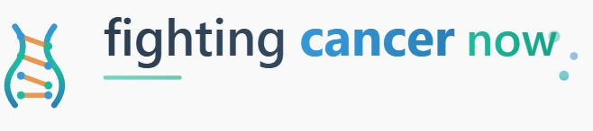

# Fighting Cancer Now


Fighting Cancer Now is an open-source global initiative aimed at centralizing cancer-related data from around the world and providing a platform for collective fundraising. The project seeks to empower patients, hospitals, researchers, and projects by offering transparent access to health data and enabling targeted support through donations.

## Vision

Our vision is to create a unified, global, and transparent system that connects individuals, organizations, and researchers in the fight against cancer. By combining open data and collective action, we aim to accelerate progress in treatment, support, and research.

## Key Features

- **Global Cancer Data Hub**: Centralization of real-world cancer statistics from reliable sources (WHO, CDC, INCA, etc.).
- **Fundraising Platform**: Donation campaigns for individuals, hospitals, oncology projects, and scientific research.
- **Transparency**: Clear reporting of where funds are directed.
- **Open Collaboration**: Contributions from developers, researchers, and volunteers worldwide.

## Repository Structure

```
/docs          Documentation and guides
/src           Source code (backend, frontend, services)
/api           API definitions and integrations
/data          Datasets and data processing scripts
/fundraising   Fundraising and donation-related modules
/tests         Automated tests
```

## Roadmap

See [ROADMAP.md](./ROADMAP.md) for upcoming milestones and goals.

## Getting Started

1. Clone the repository:
   ```bash
   git clone https://github.com/your-username/Fighting-Cancer-Now.git
   cd Fighting-Cancer-Now
   ```
2. Review the documentation in `/docs`.
3. Follow the setup guide in [CONTRIBUTING.md](./CONTRIBUTING.md).

## Contributing

We welcome contributions of all kinds: code, documentation, translations, data integration, or fundraising ideas. Please read [CONTRIBUTING.md](./CONTRIBUTING.md) before submitting a pull request.

## Code of Conduct

This project follows a [Code of Conduct](./CODE_OF_CONDUCT.md) to ensure a safe and welcoming environment for everyone.

## License

This project is licensed under the [MIT License](./LICENSE). You are free to use, modify, and distribute the code under the terms of this license.

## Contact

For questions, suggestions, or collaborations, please open an issue or contact the maintainers directly through GitHub.
